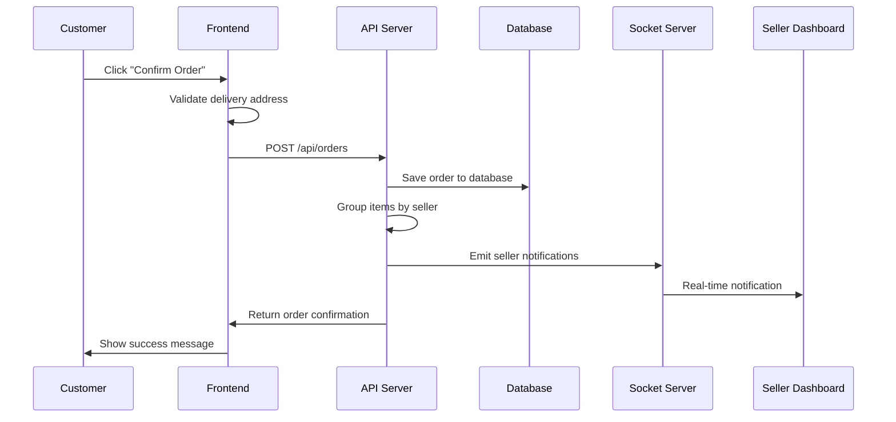
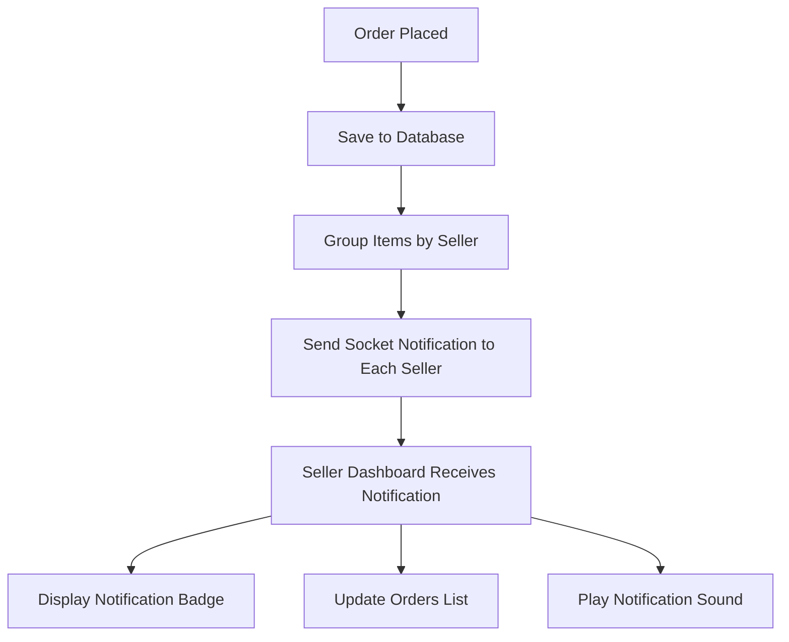

# Order Notification System - Technical Specification

## Overview
Implement a comprehensive order notification system that sends real-time notifications to sellers when customers place orders, with full database persistence and order management capabilities.

## Current System Analysis

### Existing Components
- ✅ Basic socket setup (`socket-server.js` on port 5000)
- ✅ Frontend socket client (`utils/socket.js`)
- ✅ Seller dashboard with notification display
- ✅ Checkout component with basic order placement
- ✅ User authentication and profile system
- ✅ Product and seller models

### Gaps Identified
- ❌ No Order model for database persistence
- ❌ No order management API endpoints
- ❌ No customer information collection in checkout
- ❌ Socket notifications not seller-specific
- ❌ No order status tracking
- ❌ No delivery address collection

## System Architecture

### Database Schema

#### Order Model
```javascript
{
  _id: ObjectId,
  orderNumber: String (auto-generated),
  customer: {
    user: ObjectId (ref: User),
    name: String,
    email: String,
    phone: String,
    deliveryAddress: String
  },
  items: [{
    product: ObjectId (ref: Product),
    seller: ObjectId (ref: Seller),
    name: String,
    price: Number,
    quantity: Number,
    subtotal: Number
  }],
  totalAmount: Number,
  status: String (pending, confirmed, shipped, delivered, cancelled),
  paymentMethod: String (cash_on_delivery),
  orderDate: Date,
  estimatedDelivery: Date,
  notes: String,
  createdAt: Date,
  updatedAt: Date
}
```

### API Endpoints

#### Order Routes (`/api/orders`)
- `POST /` - Create new order
- `GET /` - Get user's orders (customer view)
- `GET /seller` - Get seller's orders
- `GET /:id` - Get specific order details
- `PUT /:id/status` - Update order status (seller only)
- `PUT /:id/confirm` - Confirm order (seller)
- `PUT /:id/ship` - Mark as shipped (seller)
- `DELETE /:id` - Cancel order

### Socket Events

#### Client → Server
- `order_placed` - When customer places order
- `join_seller_room` - Seller joins their notification room

#### Server → Client
- `order_notification` - Real-time order notification to specific seller
- `order_status_update` - Order status changes
- `order_confirmed` - Order confirmation to customer

### Frontend Components

#### Enhanced Checkout Process
1. **Customer Information Section**
   - Use logged-in user profile (name, email, phone)
   - Add delivery address input field
   - Validate required fields

2. **Order Summary**
   - Display items with seller information
   - Show delivery address
   - Calculate totals per seller

3. **Order Placement**
   - Save to database first
   - Then emit socket notification
   - Handle success/error responses

#### Seller Dashboard Enhancements
1. **Real-time Notifications**
   - Join seller-specific socket room
   - Display notification badges
   - Sound/visual alerts for new orders

2. **Order Management**
   - Fetch orders from database
   - Order status management
   - Customer contact information
   - Order fulfillment tracking

## Implementation Flow

### Order Placement Process


### Notification System


## Technical Implementation Details

### 1. Order Model Creation
- Create comprehensive schema with all required fields
- Add indexes for performance (customer, seller, status, date)
- Include validation rules
- Add virtual fields for computed values

### 2. Order Controller
- Implement CRUD operations
- Add seller-specific query methods
- Include order status management
- Add order statistics and analytics

### 3. Socket Enhancement
- Implement seller-specific rooms
- Add authentication for socket connections
- Handle seller online/offline status
- Add notification queuing for offline sellers

### 4. Frontend Updates
- Add delivery address form to checkout
- Implement order confirmation flow
- Add error handling and validation
- Update seller dashboard with persistent orders

### 5. Order Status Management
- **Pending**: Initial state after order placement
- **Confirmed**: Seller accepts the order
- **Shipped**: Order dispatched for delivery
- **Delivered**: Order completed successfully
- **Cancelled**: Order cancelled by customer or seller

## Security Considerations

### Authentication & Authorization
- Verify user authentication for order placement
- Ensure sellers can only access their own orders
- Validate order ownership for status updates
- Implement rate limiting for order creation

### Data Validation
- Validate all order data before saving
- Sanitize delivery address input
- Verify product availability and pricing
- Check seller authorization for products

## Testing Strategy

### Unit Tests
- Order model validation
- Controller methods
- Socket event handling
- Frontend form validation

### Integration Tests
- Complete order flow
- Socket notification delivery
- Database persistence
- API endpoint responses

### User Acceptance Tests
- Customer order placement
- Seller notification receipt
- Order status updates
- Error handling scenarios

## Performance Considerations

### Database Optimization
- Add appropriate indexes
- Implement pagination for order lists
- Use aggregation for order statistics
- Cache frequently accessed data

### Socket Performance
- Use rooms for targeted notifications
- Implement connection pooling
- Add heartbeat mechanism
- Handle connection failures gracefully

## Deployment Considerations

### Environment Variables
- Socket server configuration
- Database connection strings
- Notification settings
- Email/SMS service credentials

### Monitoring
- Order creation metrics
- Socket connection health
- Notification delivery rates
- Error tracking and logging

## Future Enhancements

### Phase 2 Features
- Email/SMS notifications
- Order tracking with delivery updates
- Bulk order management
- Advanced analytics dashboard
- Customer order history
- Review and rating system
- Automated inventory updates
- Multi-seller order splitting
- Payment gateway integration
- Delivery scheduling system

## Success Metrics

### Key Performance Indicators
- Order notification delivery time < 1 second
- 99.9% notification delivery success rate
- Zero data loss during order placement
- Seller response time to orders
- Customer satisfaction with order process

## Risk Mitigation

### Potential Issues & Solutions
1. **Socket Connection Failures**
   - Implement automatic reconnection
   - Queue notifications for offline sellers
   - Add fallback email notifications

2. **Database Performance**
   - Implement proper indexing
   - Use connection pooling
   - Add query optimization

3. **Concurrent Order Processing**
   - Implement proper locking mechanisms
   - Handle race conditions
   - Add transaction support

4. **Scalability Concerns**
   - Design for horizontal scaling
   - Implement load balancing
   - Use Redis for session management

This comprehensive plan ensures a robust, scalable, and user-friendly order notification system that meets all business requirements while maintaining high performance and reliability.